```{r setup, include=FALSE}
knitr::opts_chunk$set(echo = FALSE)
```

# 1.0 Critiques of Data Visualisation

The Purpose of this visualisation is not conveyed well in the chart. For a period of time from 2009-2019, we aim to show the rise in median age of residents in the labour force and the change in share of the residents labour force for residents age groups “25-54” and ”55&over”. In addition, to look into the causes of this change, changes of LFPR and population are investigated to explain the above changes we have detected and we also want to show those changes.

## 1.1 Clarity
```{r}
SN <-c(1,2,3,4)
Comments <-c("The title is not clear enough as it does not point out what exact aspect(s) of labour force it would represent. Instead of saying “Residents Labour Force by Age”, “Meidan Age of Labourforce and Share of Each Age Group” would be better.","The age group are not divided properly. Too many age groups are shown in the chart that will distract user attention. We only need three age groups: ”15-24”, “25-54” and ”55&over” to focus user attention.","The chart only shows the change in share of the residents labour force. To look into the causes of this change, we also want to show changes of LFPR and population. ","The chart does not have a y axis to show what the lines represents, the units and scales. ")

clarity<-data.frame(SN,Comments)

library(knitr)
library(dplyr)
library(kableExtra)
kable(clarity,type='html',align='l') %>%
  row_spec(0, color = 'white', background = 'black', align='l') %>% #format header color and background. 
  column_spec(1:2, width_min="2em") %>%
  row_spec(1:4, extra_css = "border-bottom: 1px solid")
```


  
## 1.2 Aesthetic
```{r}
SN <-c(1,2,3)
Comments <-c("As a visualization aims to show numbers in charts and represent then in a more organized and understandable way, we are not supposed to have a table in it. ","Bar charts should be used represent discrete values instead of lines. ","x-axis does not need a tick values as it represents the age group which has a categorical scale. ")

aesthetic<-data.frame(SN,Comments)

library(knitr)
library(dplyr)
library(kableExtra)
kable(aesthetic,type='html',align='l') %>%
  row_spec(0, color = 'white', background = 'black', align='l') %>% #format header color and background. 
  column_spec(1:2, width_min="2em") %>%
  row_spec(1:3, extra_css = "border-bottom: 1px solid")
```


  
## 1.3 Ways to improve current design

### 1.3.1 Clarity
```{r}
Comments <-c("The title is not clear enough as it does not point out what exact aspect(s) of labour force it would represent. Instead of saying “Residents Labour Force by Age”, “Meidan Age of Labourforce and Share of Each Age Group” would be better.","The age group are not divided properly. Too many age groups are shown in the chart that will distract user attention. We only need three age groups: ”15-24”, “25-54” and ”55&over” to focus user attention. ","The chart only shows the change in share of the residents labour force. To look into the causes of this change, we also want to show changes of LFPR and population. ","The chart does not have a y axis to show what the lines represents, the units and scales. ")

SuggestedImprovement <-c("Set the title to be “Median Age of Labourforce and Share of Each Age Group”.","Grouped all the measures into three age groups: ”15-24”, “25-54” and ”55&over”","Integrated another two charts showing change of LFPR and population throughout the period from 2009 to 2019 for age group “25-54” and “55&over”","Do set y axis properly")

clarity<-data.frame(Comments,SuggestedImprovement)

library(knitr)
library(dplyr)
library(kableExtra)
kable(clarity,type='html',align='l') %>%
  row_spec(0, color = 'white', background = 'black', align='l') %>% #format header color and background. 
  column_spec(1:2, width="22em") %>%
  row_spec(1:4, extra_css = "border-bottom: 1px solid")

```


### 1.3.2 Aesthetic

```{r}
Comments <-c("As a visualization aims to show numbers in charts and represent then in a more organized and understandable way, we are not supposed to have a table in it. ","Bar charts should be used represent discrete values instead of lines. ","x-axis does not need a tick values as it represents the age group which has a categorical scale. ")

SuggestedImprovement<-c("Removed the table and reorganized the dashboard. The main part of the dashboard will consist of three graphs: 
Graph A: A graph combing a bar chart showing the share of labour force in the three age ranges and a line showing the median la bour force age for year 2009 and year 2019. 
Graph B: A graph showing the change of LFPR and population share of residents aged 25-54 throughout the period from 2009 to 2019.
Graph C: A graph showing the change of LFPR and population share of residents aged 55 and over throughout the period from 2009 to 2019.
","Use bar chart to show the share of labour force of different age groups.”","Remove the tick values. ")

aesthetic<-data.frame(Comments,SuggestedImprovement)

library(knitr)
library(dplyr)
library(kableExtra)
kable(aesthetic,type='html',align='l') %>%
  row_spec(0, color = 'white', background = 'black', align='l') %>% #format header color and background. 
  column_spec(1:2, width="22em") %>%
  row_spec(1:3, extra_css = "border-bottom: 1px solid")
```

  


#  2.0 Sketch of Proposed Design

```{r   scratch, echo=FALSE, out.width = '100%'}
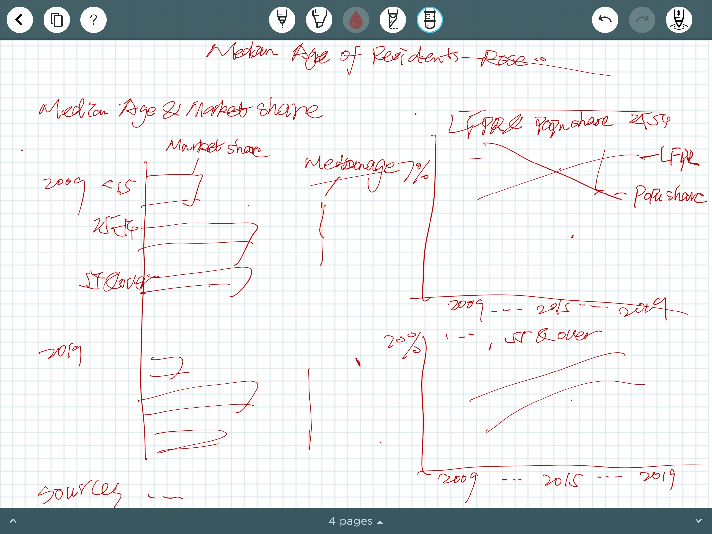

```

#  3.0 Preparing Process

##  3.1 Data Preparation


Originally, we have the absolute number of labour force and labour force participation rate by age group in a format as following. The columns represent different years and the rows represent different age range.

```{r 1, echo=FALSE, out.width = '100%'}
knitr::include_graphics("1.png")

```

```{r 2, echo=FALSE, out.width = '100%'}
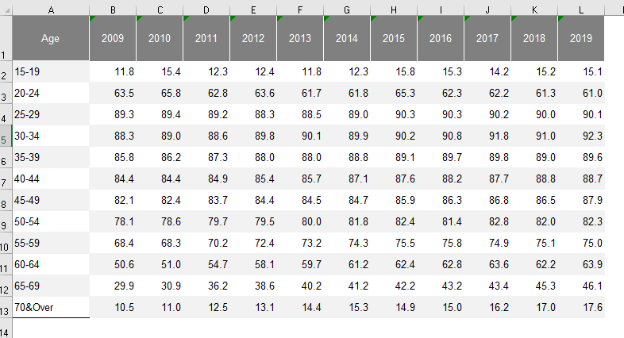

```

We need to pivot them so that they represent similar to our population table—a column for year, a column for age and a column for our measure.

```{r 3, echo=FALSE,  out.width = '100%'}
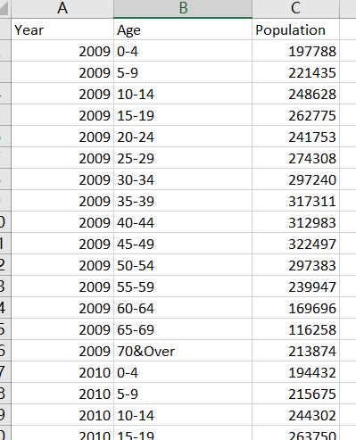

```

Tableau prep builder was used in this stage. 
We connect the original files to prep builder and choose “pivot” under the plus icon that represents the process we want to execute. After that, we say we want to pivot columns to rows and drag the columns one by one to the pivot values area and save the result tables.

```{r4, echo=FALSE,  out.width = '100%'}
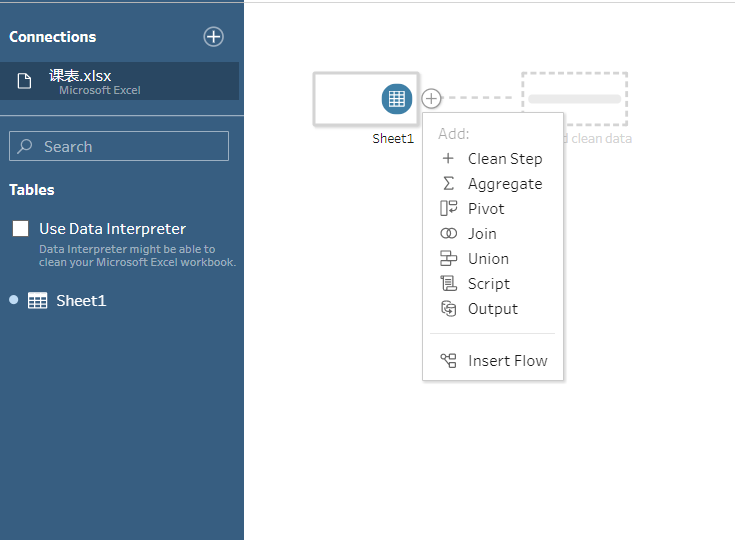

```

```{r 5, echo=FALSE, out.width = '100%'}
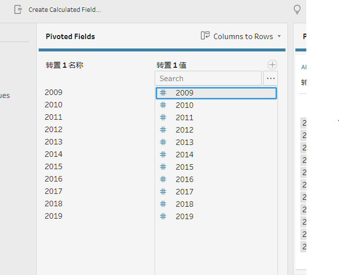

```

##  3.2 Add data sources to tableau

We connect the result tables (and the population table) to tableau and then drag the relevant sheets to the relationship generation area. We say the relationship is age=age and year=year.

```{r 6, echo=FALSE, out.width = '100%'}
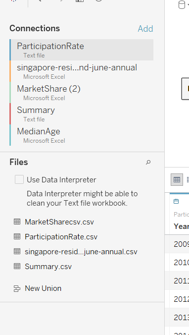

```

```{r 7, echo=FALSE, out.width = '100%'}
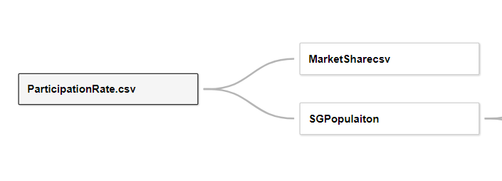

```


```{r 8, echo=FALSE, out.width = '100%'}
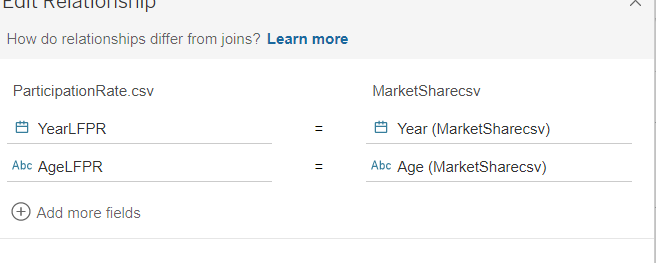

```

##  3.3 Add data sources to tableau

Using the function under “analysis” in menu, we are now able to create calculation fields we need.
We want to have LFPR, proportion in population and market share of the three age groups.

```{r9, echo=FALSE, out.width = '100%'}
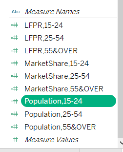

```

###  3.3.1  Example Formula for LFPR

We have LFPR of smaller age groups than expected, so we want to calculate the weighted average LFPR of residents for each of the three age groups.

```{r10, echo=FALSE, out.width = '100%'}
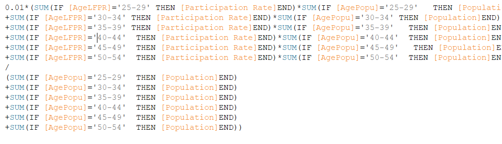

```

###  3.3.2  Example formula for market share

We have absolute number of labour force in smaller age groups than expected, so we calculate the proportion of labour force falling in each of the three age groups

```{r  11, echo=FALSE,  out.width = '100%'}
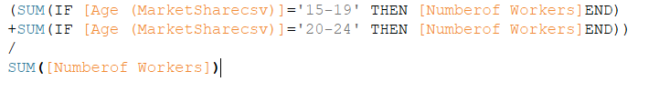

```

###  3.3.3  Example formula for proportion in population
```{r   12, echo=FALSE,  out.width = '100%'}
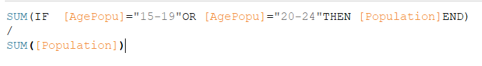

```


##  3.4 	Export summary data and add it back to tableau

The next step is to create a line(discrete) sheet that have year and measure names in columns and measure values in rows, putting the nine calculation fields we have into measure values.

```{r    13, echo=FALSE, out.width = '100%'}
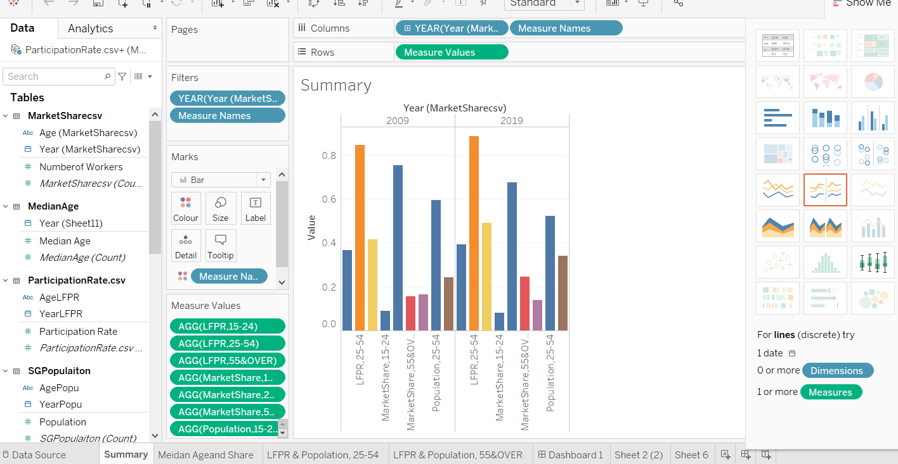

```

Then export the sheets under analysis-view data 

```{r    14, echo=FALSE, out.width = '100%'}
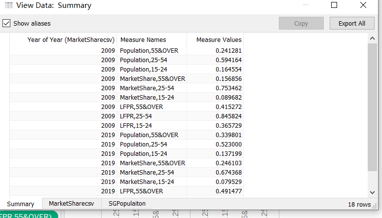

```


Then add the summary sheet back to tableau together with the median age sheet.

```{r    15, echo=FALSE,  out.width = '100%'}
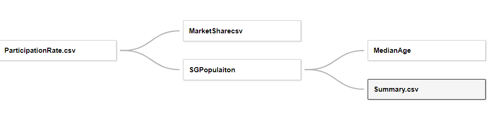

```


##  3.5 Formulate graphs

Now we can draw the graphs we want to have in our dashboard.
We say that we want to have a scatter plots under show me and we want to have market share and median age in columns and year and age range in rows (note that the order matters here because we want to group the values by age range for each year)
Then we change the graph type to be bar for market share and to be line for median age.
We say we want to set the color of the graphs by measure names

```{r    16, echo=FALSE,  out.width = '100%'}
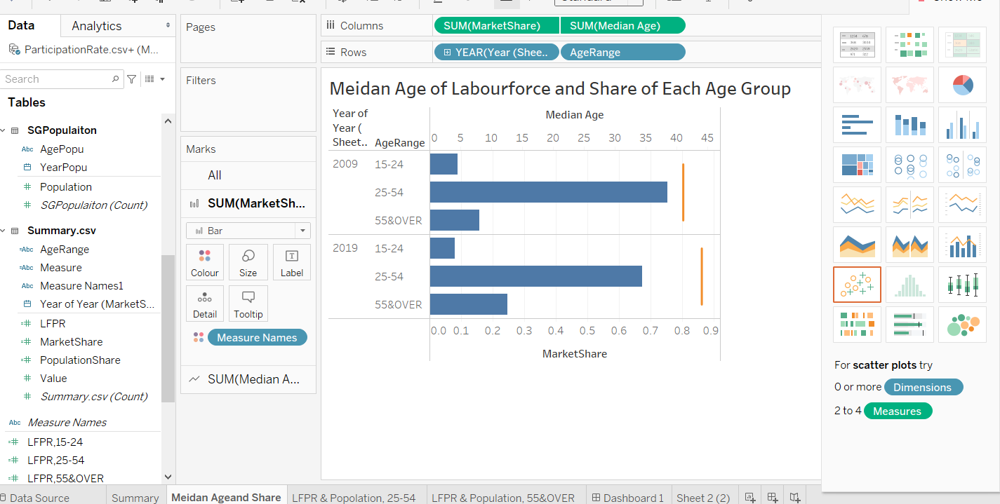

```

To look into the causes of the changes in median age and market share of labour force of different age groups, we also want to have two more charts showing change of LFPR and population throughout the period from 2009 to 2019for age group "25-54" and “55&over”
We say that we want to have a scatter plots under show me and we want to have year in columns and LFPR,25-54 and Population,25-54 in rows.
We only need observations for year 2009 and 2019, so we create a filter using year and filter out the years that we do not need.

```{r    17, echo=FALSE,  out.width = '100%'}
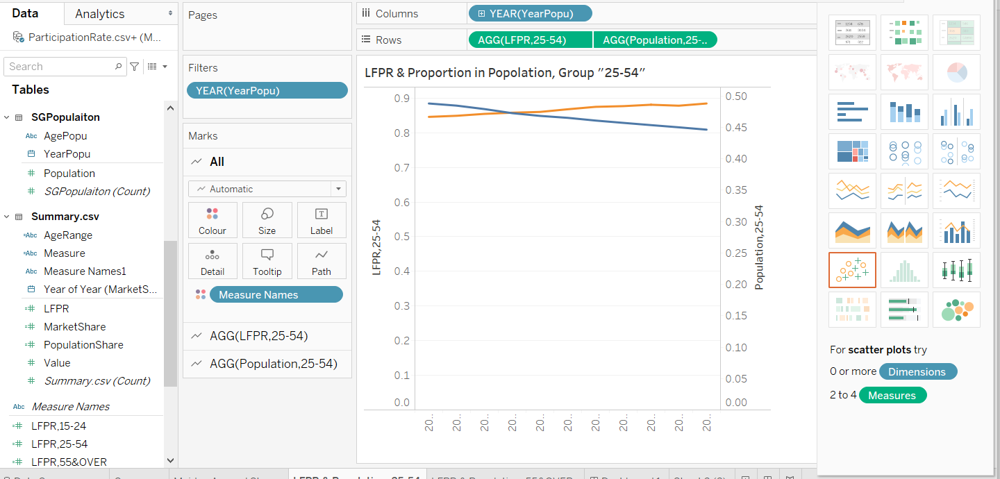

```

##  3.6 Integrate the graphs in a dashboard

```{r    18, echo=FALSE,  out.width = '100%'}
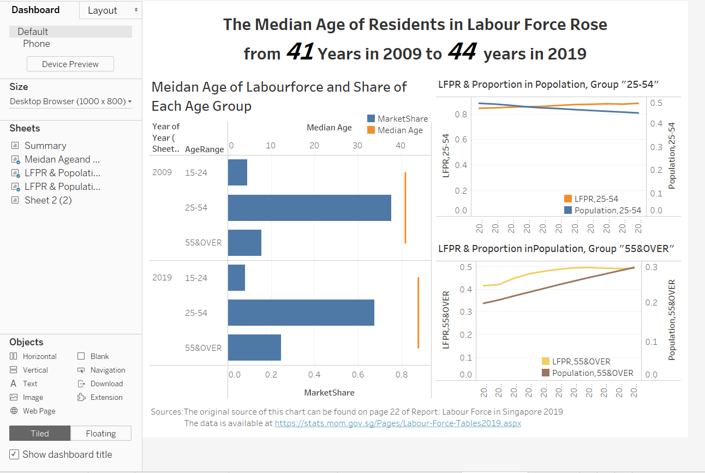

```

#  4.0 Insights gained

a.	Share of labour force aged 55 and over increased from 2009 to 2019.
b.	Share of labour force aged 25-54 declined from 2009 to 2019.
c.	Together, those two phenomena have resulted in an increase in median age of labour force.
d.	The increasing LFPR of residents aged 55 and over together with their proportion in the population have caused their increased share in the labour force.
e.	Share of labour force aged 25-54 declined even as their LFPR increased due to their decreasing proportion in population


