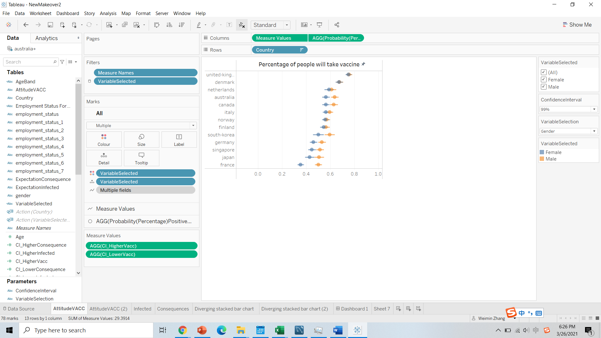

```{r setup, include=FALSE}
knitr::opts_chunk$set(echo = FALSE)
```

# 1.0 Critiques of Data Visualisation


a. Clarity
```{r}
SN <-c(1,2,3,4,5)
Comments <-c("The colors of each categorical level in the stacked bar chart representing the attitude towards vaccine are not set properly. A diverging palette should be used for variables with a meaningful order type.","The scale of the stacked bar chart representing the attitude towards vaccine is not set properly. For easy comparison, the zero point should be set at the middle of the categorical level that represents the moderate attitude of comments.","For the scatter plot chart, the percentage of strongly agree itself can not provide us a full view on which country is more pro-vaccine. We might also want to know how this result based on sample values could be projected to the population.","For easy comparison, the order of how the countries is represented in these two charts should be the same.","To get actionable insights, in addition to a general understanding of which country is more pro-vaccine, we might want to figure out reasons behind this attitude. ")

clarity<-data.frame(SN,Comments)

library(knitr)
library(dplyr)
library(kableExtra)
kable(clarity,type='html',align='l') %>%
  kable_styling () %>%
  row_spec(0, color = 'white', background = 'black', align='l') %>% #format header color and background. 
  column_spec(1:2, width_min="3em") %>%
  row_spec(1:5, extra_css = "border-bottom: 1px solid")
```


b. Aesthetic
```{r}
SN <-c(1,2,3,4,5)
Comments <-c("What we would like to show the users at the first glance is an intuitive visual display of which country is more pro-vaccine. A scatter plot with error bar is more suitable for this task and should be more ye catching. ","The legend title ”vac 1” has no meaning. Actually, we do not need a legend title. ","The legend of the stacked bar chart is too far away and is not nicely presented.","Scale of the x-axis of the two charts are not synchronized with inconsistent x-axis labels across the two charts. The x-axis labels for the left chart is shown as whole number while the right chart us shown to 1 decimal place.","Since we can easily recognise the y aixs of the two charts arrange countries, a field label is not needed. ")

aesthetic<-data.frame(SN,Comments)

library(knitr)
library(dplyr)
library(kableExtra)
kable(aesthetic,type='html',align='l') %>%
  kable_styling () %>%
  row_spec(0, color = 'white', background = 'black', align='l') %>% #format header color and background. 
  column_spec(1:2, width_min="3em") %>%
  row_spec(1:5, extra_css = "border-bottom: 1px solid")
```


## 1.1 Ways to improve current design

a. Clarity
```{r}
Comments <-c("The colors of each categorical level in the stacked bar chart representing the attitude towards vaccine are not set properly. A diverging palette should be used for variables with a meaningful order type.","The scale of the stacked bar chart representing the attitude towards vaccine is not set properly. For easy comparison, A zero point should be set at the middle of the categorical level that represents the moderate attitude of comments.","The percentage of strongly agree itself can not illustrate what we are aiming to figure out—which country is more pro-vaccine.","For easy comparison, the order of how the countries is represented should be the same.","To get actionable insights, in addition to a general understanding of which country is more pro-vaccine, we might want to figure out reasons behind this attitude.")

SuggestedImprovement <-c("A diverging palette should be used for a variable showing the degree of support for vaccines.","A zero point should be set at the middle of the “3” categorical level, since it represents the medium degree of support for vaccine among the five.","Error bars should be added to the scatter plot to represent probability of agree with confidence interval.","Order the countries of these two charts similarly.","Add additional charts depicting other fields to allow readers to deep dive further into the survey results and figure out reasons behind this attitude.")

clarity<-data.frame(Comments,SuggestedImprovement)

library(knitr)
library(dplyr)
library(kableExtra)
kable(clarity,type='html',align='l') %>%
  kable_styling () %>%
  row_spec(0, color = 'white', background = 'black', align='l') %>% #format header color and background. 
  column_spec(1:2, width_min="30em") %>%
  row_spec(1:5, extra_css = "border-bottom: 1px solid")

```


b. Aesthetic

```{r}
Comments <-c("What we would like to show the users at the first glance is an intuitive visual display of which country is more pro-vaccine. A scatter plot with error bar is more suitable for this task and should be more ye catching.","The legend title ”vac 1” has no meaning. Actually, we do not need a legend title.","The legend of the stacked bar chart is too far away and is not nicely presented.","Inconsistent x-axis labels across the two charts, where the x-axis labels for the left chart is shown as whole number while the right chart us shown to 1 decimal place.","Since we can easily recognise the y aixs of the two charts arrange countries, a field label is not needed")

SuggestedImprovement<-c("Make the stacked bar chart showing on the left of the stacked bar chart and the portions of the stacked bar chart highlighted based on the country selected in the scatter plot chart.","Unshown the legend.","Place the legend adjacent to the stacked bar chart and edit the aliases so that it indicates the support degree to vaccine.","Synchronised the scale of the two charts and standardised the decimal places across all the axis.","Remove the field label.")

aesthetic<-data.frame(Comments,SuggestedImprovement)

library(knitr)
library(dplyr)
library(kableExtra)
kable(aesthetic,type='html',align='l') %>%
  kable_styling () %>%
  row_spec(0, color = 'white', background = 'black', align='l') %>% #format header color and background. 
  column_spec(1:2, width_min="30em") %>%
  row_spec(1:5, extra_css = "border-bottom: 1px solid")
```


# 2.0 Sketch of Proposed Design
```{r 1, echo=FALSE, out.width =400}

```


Work done:
Add error bars into the scatter plot showing the percentage of people that will take vaccine.
Add the parameter “confidence level” to allow user select the confidence level they would like to accept.
Sorted country in all the charts by probability of positive attitude to vaccine.
Synchronize the axis of the charts.
Set the color of the stacked bar chart properly.
Add interactive action to allow user manipulate the visualization.
a) By default, the “infection expectation” and “consequence expectation” charts will not show. It will only show when the user say that he would like to learn more.
b) Country(s) will be highlighted in the stacked bar chart if user select the particular country or hover around the particular country in the scatter plot showing the percentage of people that will take vaccine.


# 3.0 Preparing Process

###   3.1	Data Preparation

Since the data have many field that are not useful for the analytics purpose, delete the extra columns.


```{r 2, echo=FALSE, out.width = 400}

```


b.	Add data sources to tableau

Since each country’s data comprises a separate csv file, keep all the files in a single folder and then connect one of them to tableau, all the files within the folder will show on the files field.
We need to remove the file imported first and then double click “new union”, drag all the files into the union creating field.


```{r 3, echo=FALSE, out.width = 400}

```


```{r 4, echo=FALSE, out.width = 400}

```

Then your data source would look like below. We would have only one file that is the union file and a column called table name are automatically generated. In this case, we use it to indicate the country. Right click the header of each column to rename and edit aliases of that measure.


```{r 5, echo=FALSE, out.width = 400}

```


```{r 6, echo=FALSE, out.width = 400}

```


###   3.2	Create the scatter plot chart with error bar 


We are going to check the probability of positive attitude and its lower and higher confidence interval.

First of all, we are going to create a parameter to indicate the confidence level we would like to 
accept. Click the small triangle in the data field of our sheet, we can create parameters. Set the datatype to be “string” and allowable values to be list and input the value of the list in the list editing field.


```{r 7, echo=FALSE, out.width = 400}

```


```{r 8, echo=FALSE, out.width = 400}
knitr::include_graphics("8.png")
```

After that, we need to create a calculation field called Z that identify the z value of different confidence levels.

```{r 9, echo=FALSE, out.width = 400}

```


Then we are able to calculate the probability of positive views and the error bar. Six calculation fields are need here.


```{r 10, echo=FALSE, out.width = 400}

```


```{r 11, echo=FALSE, out.width = 400}

```


```{r 12, echo=FALSE, out.width = 400}

```


```{r 13, echo=FALSE, out.width = 400}

```


```{r 14, echo=FALSE, out.width = 400}

```


```{r 15, echo=FALSE, out.width = 400}

```


```{r 16, echo=FALSE, out.width = 400}

```


With these calculation fields, we are able to draw our scatter plots now.
We drag measure values to columns and country to rows. For the measure values, we only need the CI_lower and CI_higher.
Then we drag ProbabilityPositiveView into the graph. Then we under the “measure values”mark, we set the graph pattern to line and measure values as the path variable. 
As the last step, we set sort country descendingly by ProbabilityPsotiveView.

```{r 17, echo=FALSE, out.width = 400}

```


```{r 18, echo=FALSE, out.width = 400}

```


```{r 19, echo=FALSE, out.width = 400}

```


###   3.3 Create the stacked barchart

We are going to calculate the starting point of each level of attitude toward vaccine and let the length of them to be their percentage over the total observation.

Six calculation fields needed here.


```{r 20, echo=FALSE, out.width = 400}

```


```{r 21, echo=FALSE, out.width = 400}

```


```{r 22, echo=FALSE, out.width = 400}

```


```{r 23, echo=FALSE, out.width = 400}

```


```{r 24, echo=FALSE, out.width = 400}

```


```{r 25, echo=FALSE, out.width = 400}

```


```{r 26, echo=FALSE, out.width = 400}

```


```{r 27, echo=FALSE, out.width = 400}

```


```{r 28, echo=FALSE, out.width = 400}

```


###   3.4 Create the dashboard
Drag the individual graph into the area wanted
Add the actions that allow user to manipulate the data visualization.
Three actions need here.
One is filter action that filter out all value of the infection and consequence charts. Values in these two charts will only show when user selected the country in the AttitudeVACC chart.
The other two highlight action will highlight the countries selected or hovered around in the Attitude VACC chart.

```{r 29, echo=FALSE, out.width = 400}
knitr::include_graphics("29.png")
```


```{r 30, echo=FALSE, out.width = 400}
knitr::include_graphics("30.png")
```


```{r 31, echo=FALSE, out.width = 400}

```


# 4.0 Conclusion
a.	The five most_pro_vaccine countries show a negative relationship between attitude to vaccine and infection expectation; The five least_pro_vaccine countries show a positive relationship between attitude to vaccine and infection expectation.

b.	Two great leaps of consequence expectation could be observed at the third and nineth most_pro_vaccine countries. Which means if we divided the countries into three groups based on attitude toward vaccine, in the group level, consequence expectation and attitude toward vaccine relates negatively—those are more likely to get the vaccine believe that they have a higher probability of bad consequence if infected. Within each group, however, those are more likely to get the vaccine believe that they have a less probability of bad consequence if infected.


