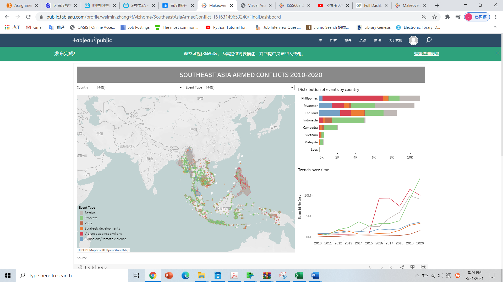
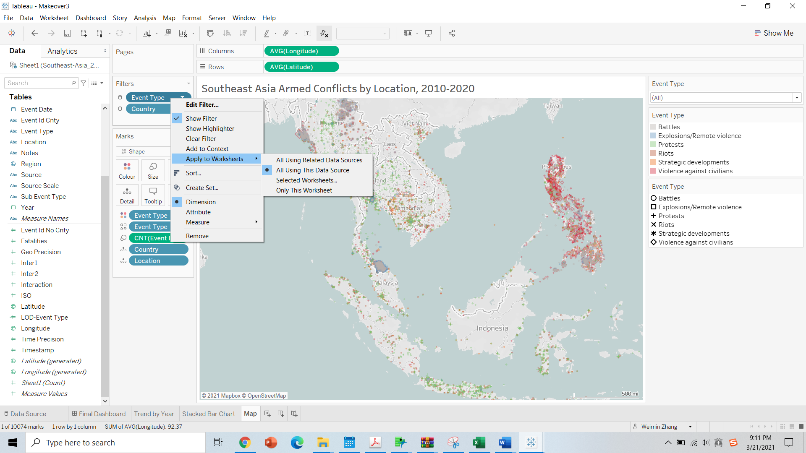
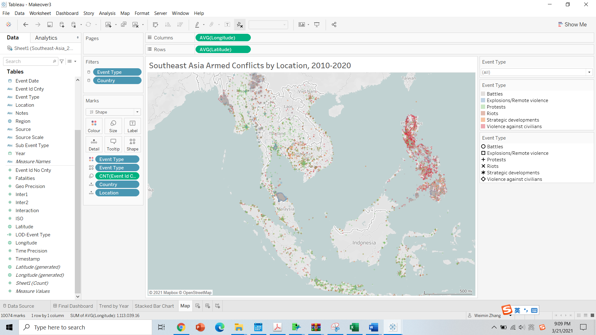
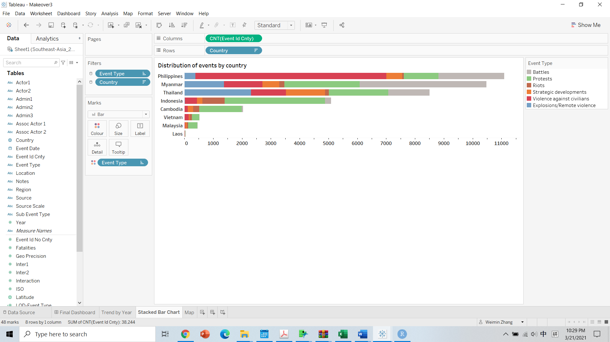
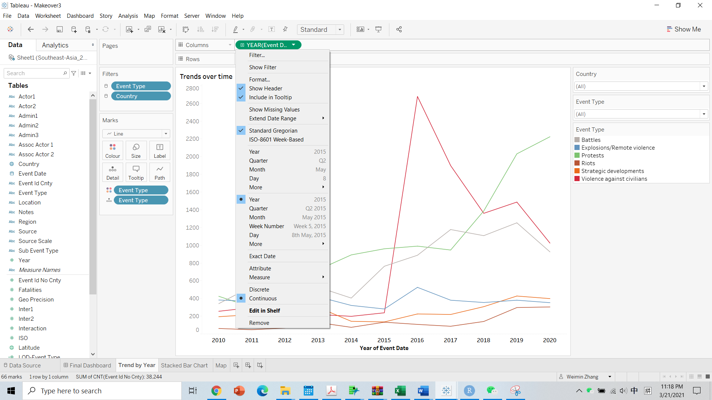
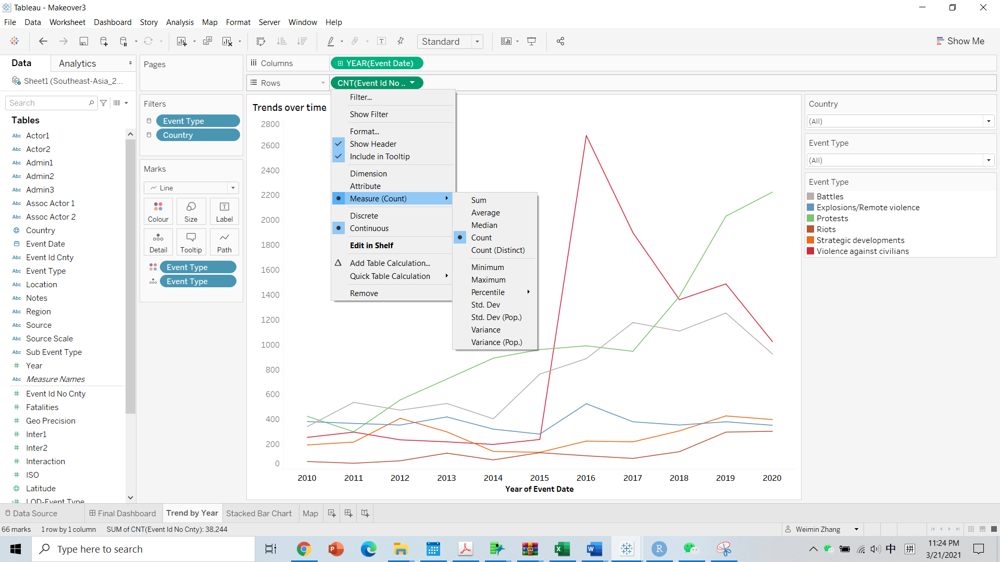

```{r setup, include=FALSE}
knitr::opts_chunk$set(echo = FALSE)
```

# 1.  Critiques of Data Visualisation


#### a. Clarity

```{r 1, echo=FALSE, out.width =400,fig.align = 'center' }
knitr::include_graphics("1.png")
```

#### b. Aesthetic
```{r 2, echo=FALSE, out.width =400,fig.align = 'center' }
knitr::include_graphics("2.png")
```

### 1.1  Ways to improve current design

#### a. Clarity

```{r 3, echo=FALSE, out.width =400,fig.align = 'center' }
knitr::include_graphics("3.png")
```

#### b. Aesthetic
```{r 4, echo=FALSE, out.width =400,fig.align = 'center' }
knitr::include_graphics("4.png")
```

# 2. Sketch of Proposed Design


```{r 5, echo=FALSE, out.width =400,fig.align = 'center' }

```


1. Add a stacked bar chart depicting the aggregate number of conflicts for the six years.
2. Instead of opaque points, use points with a certain level of transparency in the map.
3. Put the lines in one chart, using different color to differentiate different kinds of conflicts.


# 3.  Preparing Process
### 3.1	Map
1.	Drag ‘Longitude’ and ‘Latitude’ to Columns and Rows respectively.
2.	Click on Fix Map icon and adjust the size of map to show all eight countries.
3.	Drag “Event Type” and “Country” to filter and apply the filters to all worksheets using this data.
4.	Drag contry and location to the map to show she detail.
5.	Change the mark type to be shape.
6.	Set the shape decision variable for both color and to be event type.
7.	Set the size decision variable to be event id cnty and set its measure to be count.

```{r 6, echo=FALSE, out.width =400,fig.align = 'center' }

```

```{r 7, echo=FALSE, out.width =400,fig.align = 'center' }

```

### 3.2 Stacked Bar Chart

1.	Drag ‘Event Id Cnty’ and ‘Country’ to Columns and Rows respectively and set Measure of ‘Event Id Cnty’ as ‘Count’.
2.	Set the color decision variable to be event type
3.	Since have applied the event type and country filters to all worksheets using this data, you will see them already there.

```{r 8, echo=FALSE, out.width =400,fig.align = 'center' }

```

### 3.3 Trend by year

1.	Drag ‘event date’ to Columns and choose continuous year.
2.	Drag “event id No cnty” to Rows and set its measure to be count.
3.	Drag event type into the graph canvas.
4.	Set the color decision variable to be event type

```{r 9, echo=FALSE, out.width =400,fig.align = 'center' }

```

```{r 10, echo=FALSE, out.width =400,fig.align = 'center' }

```

### 3.3 The Dash Board
```{r 11, echo=FALSE, out.width =400,fig.align = 'center' }

```


# 4. Conclusion
a. Philippines has the greatest number of armed conflicts in southeast Asia and violence against civilians is the most frequent type of armed conflicts in Philippine; Myanmar has the second greatest number of armed conflicts in southeast Asia and battles is the most frequent type of conflicts in Myanmar.

b. Since 2015, armed conflicts in southeast Asia have shot up. Violence against civilians, battles and protests are the kinds of armed conflicts that have increased with a higher speed, which is caused by the introduce of Philippine data.

c. In Malaysia, Indonesia and Cambodia, protest is the most frequent kinds of armed conflict.

d. Battles and remote violence centralise in several region, mainly in  Philippine, Myanmar and Thailand.

